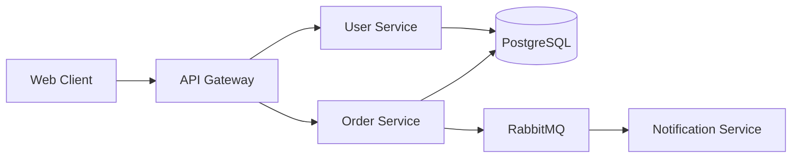

<!-- Part of the technical-writing AbsolutelySkilled skill. Load this file when
     working with architecture documentation or system design docs. -->

# Architecture Documentation

## Purpose

Architecture docs answer two questions: "How is this system built?" and "Why was
it built this way?" They are the context layer that enables engineers to make
informed changes to a system they did not design.

## The C4 model

Use Simon Brown's C4 model as the default structure. It provides four levels of
zoom, each serving a different audience:

### Level 1: System context diagram

Shows the system as a single box, surrounded by the users and external systems it
interacts with. This is the 30-second overview.

```
[User] --> [Your System] --> [Payment Provider]
                         --> [Email Service]
                         --> [Analytics Platform]
```

Include: system name, actors, external dependencies, data flow direction.
Exclude: internal components, technology choices.

### Level 2: Container diagram

Shows the major deployable units inside the system - services, databases, message
queues, CDNs. This is the "what gets deployed" view.

```
[Web App (React)] --> [API Gateway (Kong)]
                      --> [User Service (Node.js)]
                      --> [Order Service (Go)]
                      --> [PostgreSQL]
                      --> [Redis Cache]
                      --> [RabbitMQ]
```

Include: container names, technology choices, communication protocols.
Exclude: internal module structure.

### Level 3: Component diagram

Shows the major structural building blocks inside a single container. Only create
this for containers that are complex enough to warrant it.

Include: modules, services, repositories, controllers and their relationships.
Exclude: individual classes or functions.

### Level 4: Code diagram

UML class diagrams or similar. Only for genuinely complex algorithms or patterns.
Most systems never need this level.

## Diagram tools

| Tool | Format | Best for |
|------|--------|----------|
| Mermaid | Markdown-embeddable | Docs-as-code, GitHub rendering |
| PlantUML | Text-based | Detailed UML, sequence diagrams |
| Structurizr | C4-native DSL | Full C4 model with workspace |
| Excalidraw | Visual/hand-drawn style | Informal, whiteboard-feel diagrams |
| draw.io | Visual editor | Complex diagrams with manual layout |

Prefer text-based diagrams (Mermaid, PlantUML) for docs that live in Git.
They diff cleanly, render in Markdown, and cannot go stale as easily as images.

### Mermaid example

````markdown

````

## Architecture doc template

```markdown
# [System Name] Architecture

## Overview

[2-3 sentences: what this system does and its primary value proposition.]

## System context

[Level 1 diagram + 1 paragraph listing key actors and external dependencies.]

## Containers

[Level 2 diagram + a table describing each container:]

| Container | Technology | Purpose |
|-----------|-----------|---------|
| API Gateway | Kong | Route requests, rate limiting, auth |
| User Service | Node.js | User CRUD, authentication |
| PostgreSQL | v16 | Primary datastore |

## Key design decisions

[Link to relevant ADRs or summarize the 3-5 most important decisions:]

- **ADR-001:** Chose event-driven architecture for order processing
- **ADR-003:** PostgreSQL over MongoDB for ACID guarantees

## Data flow

[Sequence diagram or prose describing the primary request path.]

## Infrastructure

[Where it runs: cloud provider, regions, scaling approach.]

## Known limitations

[Current technical debt, scaling bottlenecks, planned improvements.]
```

## Keeping architecture docs alive

Architecture docs rot faster than any other documentation type. Strategies to
keep them current:

1. **Link ADRs to architecture docs** - When an ADR changes the architecture,
   update the architecture doc in the same PR
2. **Auto-generate diagrams** - Use tools that generate diagrams from code or
   infrastructure (e.g., Structurizr from code annotations)
3. **Quarterly review cadence** - Schedule a calendar reminder to review
   architecture docs with the team
4. **Ownership** - Assign an explicit owner to each architecture doc
